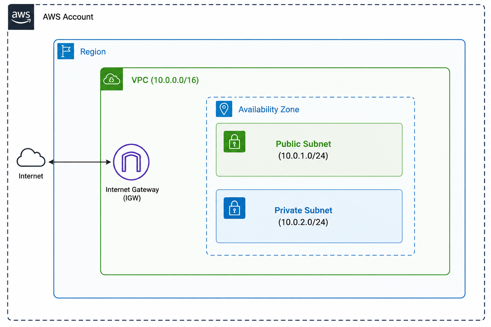

# Lab 1B: Design and Build a Basic VPC Network Using Terraform

## Overview

This lab walks through writing Terraform configuration files to provision a basic Virtual Private Cloud (VPC) network in AWS. By the end of the lab, you will have created:

1. A Virtual Private Cloud (VPC)
2. One public subnet within the VPC
3. One private subnet within the VPC

## Architecture

The lab builds the following network layout in a single AWS Region:



- The **VPC** uses CIDR block `10.0.0.0/16`.
- The **public subnet** (`10.0.1.0/24`) has a route to the Internet Gateway and auto-assigns public IPs to instances launched in it.
- The **private subnet** (`10.0.2.0/24`) has no route to the internet and does not auto-assign public IPs.
- An **Internet Gateway (IGW)** is attached to the VPC and used by the public route table.

## Prerequisites

- [Terraform](https://developer.hashicorp.com/terraform/downloads) v1.x installed
- An AWS account with credentials configured (e.g. via `aws configure` or environment variables)
- AWS provider version `~> 5.0`

## Project Structure

```
lab1B/
├── main.tf
├── variables.tf
└── outputs.tf
```

## Step-by-Step Guide

### Step 1: Create Project Structure

Create a clean working directory and the three base files:

```bash
mkdir lab1B && cd lab1B
touch main.tf variables.tf outputs.tf
```

### Step 2: Configure the Provider

In `main.tf`, declare the required provider and configure the AWS provider to use a region variable:

```hcl
terraform {
  required_providers {
    aws = {
      source  = "hashicorp/aws"
      version = "~> 5.0"
    }
  }
}

provider "aws" {
  region = var.region
}
```

### Step 3: Define Variables

In `variables.tf`, define the variables used throughout the configuration:

```hcl
variable "region" {
  default = "us-east-1"
}

```

### Step 4: Create the VPC

In `main.tf`, define the VPC resource:

```hcl
resource "aws_vpc" "main" {
  cidr_block = "10.0.0.0/16"

  tags = {
    Name = "Terraform-VPC"
  }
}
```

### Step 5: Create the Internet Gateway

Attach an Internet Gateway to the VPC:

```hcl
resource "aws_internet_gateway" "igw" {
  vpc_id = aws_vpc.main.id

  tags = {
    Name = "VPC-IGW"
  }
}
```

### Step 6: Create the Public and Private Subnets

```hcl
resource "aws_subnet" "public" {
  vpc_id                  = aws_vpc.main.id
  cidr_block              = "10.0.1.0/24"
  map_public_ip_on_launch = true

  tags = {
    Name = "Public-Subnet"
  }
}

resource "aws_subnet" "private" {
  vpc_id     = aws_vpc.main.id
  cidr_block = "10.0.2.0/24"

  tags = {
    Name = "Private-Subnet"
  }
}
```

### Step 7: Create the Route Table

Create a public route table that sends all outbound traffic (`0.0.0.0/0`) to the Internet Gateway, and associate it with the public subnet:

```hcl
resource "aws_route_table" "public_rt" {
  vpc_id = aws_vpc.main.id

  route {
    cidr_block = "0.0.0.0/0"
    gateway_id = aws_internet_gateway.igw.id
  }

  tags = {
    Name = "Public-Route-Table"
  }
}

resource "aws_route_table_association" "public_assoc" {
  subnet_id      = aws_subnet.public.id
  route_table_id = aws_route_table.public_rt.id
}
```

### Step 8: Define Outputs

In `outputs.tf`, output the IDs of the resources created so they are easy to reference:

```hcl
output "vpc_id" {
  value = aws_vpc.main.id
}

output "public_subnet_id" {
  value = aws_subnet.public.id
}

output "private_subnet_id" {
  value = aws_subnet.private.id
}
```

### Step 9: Run the Project

From within the `lab1B/` directory, run the following commands in order:

```bash
terraform init       # Initialize the working directory and download providers
terraform fmt         # Format configuration files to canonical style
terraform validate    # Validate the configuration syntax and internal consistency
terraform plan        # Preview the changes Terraform will make
terraform apply       # Create the resources in AWS
```

#### Cleanup

When you are done, destroy all resources created by this lab to avoid ongoing AWS charges:

```bash
terraform destroy
```

## Variable Files and Precedence

Terraform allows you to override variable defaults in several ways.

### Passing Variables via Command Line

This overrides the default value of `region` (and/or other variables) for a single run.

**Syntax:**
```bash
terraform apply -var="key=value"
```

**Example — passing a single variable:**
```bash
terraform apply -var="region=us-west-2"
```

**Example — passing multiple variables:**
```bash
terraform apply \
  -var="region=us-east-1" \
  -var="instance_type=t3.micro"
```

### Using a Variable File (`.tfvars`)

Create a `terraform.tfvars` file in the project directory:

```hcl
region        = "us-east-1"
instance_type = "t2.micro"
```

Then apply using the `-var-file` flag:

```bash
terraform apply -var-file="terraform.tfvars"
```

> **Note on precedence:** Command-line `-var` flags take precedence over values in `.tfvars` files, which in turn take precedence over the `default` values declared in `variables.tf`.

## Summary

| Resource | Purpose |
|---|---|
| `aws_vpc.main` | The Virtual Private Cloud (10.0.0.0/16) |
| `aws_internet_gateway.igw` | Provides internet access for the VPC |
| `aws_subnet.public` | Public subnet (10.0.1.0/24) with auto-assigned public IPs |
| `aws_subnet.private` | Private subnet (10.0.2.0/24), no internet route |
| `aws_route_table.public_rt` | Routes public subnet traffic to the IGW |
| `aws_route_table_association.public_assoc` | Associates the public subnet with the public route table |
